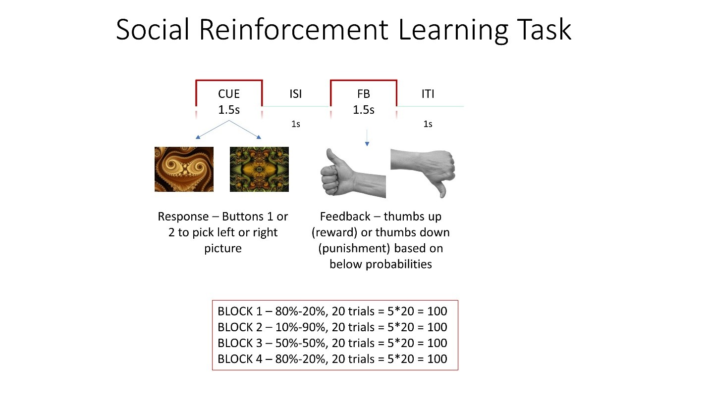

**Social Reinforcement Learning**: During the task, participants learn to choose one of the two fractal stimuli presented on the screen at a time in order to obtain a reward (cheer sound + thumbs up visual) and avoid punishment (booing sound + thumbs down visual). The associations of the stimuli and outcome change throughout the block and participants have to modify their choice based on their reinforcement history. The probability of associations changes from 80% (picture A)-20% (picture B), 10 (picture A)-90 (picture B),50 (picture A)-50 (picture B), 80 (picture A)-20% (picture B). These associations are pre-defined. We will repeat this task 3 times, so we will use different stimuli each time.

**Paper references**: Kumar et al 2008, Gradin et al 2011 (similar tasks)

